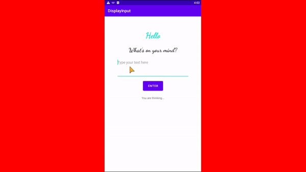

# DisplayInput

This repo is part of the stage 2 tasks for [Zuri Internship](https://internship.zuri.team).  

## Tasks

1. A simple code that prints a string (my name) using kotlin programming language. View the file [saymyname.kt](saymyname.kt)
2. This a simple android app that takes user input as text and displays it.

### Usage and Description

Try the app [here](https://appetize.io/app/fyye8jtvzcnx1qmg8hexpzv1nw?device=nexus5&scale=75&orientation=portrait&osVersion=8.1).
